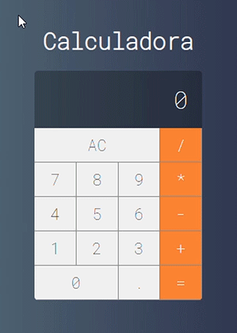

# Projeto-Calculadora-VueJs
Projeto de estudo criando réplica da calculadora do MacOS usando VueJs

Projeto criado como parte dos estudos de VueJs no curso: <a href="https://www.udemy.com/course/curso-web/" target="blank">Web Moderno com JavaScript 2020</a>